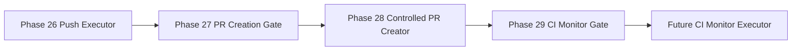

# Omni CI Monitor Gate

Phase 29 sits after the Controlled PR Creator and before any future CI Monitor Executor.

The gate links Phase 28 PR creator evidence, Phase 27 PR gate evidence, and Phase 26 push evidence. It produces:

- Runtime Truth event `sandbox.ci_monitor_gate.decision`.
- `ci_monitor_eligible` as a metadata-only readiness decision.
- A bounded `ci_monitor_plan` with expected providers, workflows, required checks, polling strategy, and terminal states.
- Required pre-CI-monitor checks.

It deliberately does not query GitHub, CircleCI, workflow runs, check runs, or logs. It also does not execute commands, use `gh`, mutate Git, push, merge, rebase, create/update PRs, approve PRs, call providers, call MCP, call agents, write Vault notes, edit files, or apply patches.

The future executor must revalidate this evidence before any real monitoring happens.
