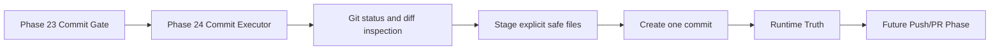

# Omni Controlled Commit Executor Architecture

Phase 24 turns clean commit eligibility metadata into one controlled Git commit on a non-main branch.

## Scope

The executor is intentionally narrow. It creates a commit only after clean Phase 23 evidence and only through a fixed Git operation allowlist.

It does not push, open PRs, merge, rebase, create branches, checkout or switch branches, edit files, apply patches, call providers, call MCP, call agents, use network access, write source files, write Vault files, or execute arbitrary commands.

## Execution Model

Modes:

- `disabled`
- `dry_run`
- `commit_to_branch`
- `blocked`

`disabled` is the default. `dry_run` validates metadata without staging or committing. `commit_to_branch` verifies branch state, inspects status, stages only safe eligible files, creates one commit, and records Runtime Truth.

## Git Boundary

All Git execution is argv based, uses `shell=False`, an explicit `cwd`, a timeout, bounded output capture, and redaction.

Allowed operations are:

- branch verification
- head capture
- short status
- diff name listing
- explicit safe file staging
- one commit message based commit

Push, merge, rebase, checkout, switch, branch creation, GitHub CLI, hook bypass, reset, restore, and broad staging are outside this phase.

## Evidence Linkage

The executor carries Phase 23 Runtime Truth as child evidence and emits `sandbox.commit_executor.commit`.

The result records:

- requested and staged files
- blocked files
- final commit message
- pre-commit head
- post-commit head
- commit SHA
- attempted/completed/blocked Git operations
- status before and after
- follow-up push/PR phase requirements

## Follow-Up

After a successful commit, `requires_push_phase` and `requires_pr_phase` become true. The executor itself cannot push or open a PR; those capabilities belong to later governed phases.

Phase 25 is the first push eligibility layer. It consumes this commit evidence and produces a metadata-only push plan without mutating remotes.
