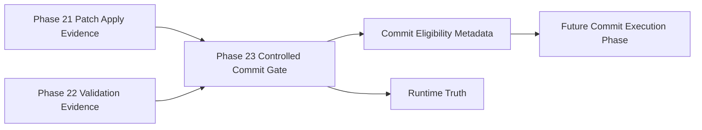

# Omni Controlled Commit Gate Architecture

Phase 23 introduces a metadata-only gate between post-patch validation and any future commit execution phase.

## Responsibility

The Controlled Commit Gate answers one question: is the validated patch state eligible for a future governed commit phase?

It does not stage files, commit, push, open a pull request, merge, rebase, run commands, edit code, apply patches, call providers, call MCP, call agents, use network access, or write Vault files.

## Inputs

The gate accepts supplied metadata only:

- Phase 22 post-patch validation result
- Phase 21 patch application result
- optional Phase 20 patch proposal result
- optional Phase 19 repair plan
- branch metadata
- file metadata
- validation summaries
- commit message hint
- caller metadata

It does not inspect Git, read files, or discover repository state by itself.

## Decision Model

The gate can run in:

- `disabled`
- `dry_run`
- `evaluate_commit`
- `blocked`

`disabled` is the default. `evaluate_commit` may mark `commit_eligible` true only when patch evidence is clean, validation passed, branch metadata is non-main, files are safe, Runtime Truth is present when required, and no protected source activity is detected.

`dry_run` validates evidence but does not mark commit eligibility true.

## Output

The result includes:

- `commit_eligible`
- `commit_ready_metadata_only`
- `commit_plan`
- `proposed_commit_message`
- `required_pre_commit_checks`
- source evidence linkage
- blocked and escalation reasons
- Runtime Truth

All execution capability flags remain false.

## Safety Boundaries

The gate blocks:

- main branch and protected branch metadata
- failed or timed-out validation
- missing patch or validation evidence
- protected files
- secret-like content
- Git mutation evidence
- main modification evidence
- PR creation or merge evidence
- command execution evidence from patch application
- provider, network, MCP, or Vault activity evidence

Secret-like content is redacted before it appears in output.

## Future Integration

A future phase may consume `commit_eligible`, `commit_plan`, and `proposed_commit_message`. That future phase must implement its own human approval, Runtime Truth, and command execution controls before any real staging or commit operation is permitted.

Phase 24 is that first commit execution layer. It consumes this gate evidence, verifies the non-main branch, stages explicit safe files, creates one commit, and still does not push, open PRs, merge, or rebase.
