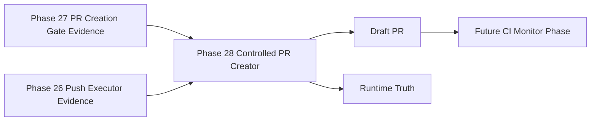

# Omni Controlled PR Creator

Phase 28 moves Omni from PR eligibility metadata to controlled PR creation.

## Execution Boundary

The creator does not execute commands, mutate Git, push, merge, rebase, checkout, switch branches, edit files, apply patches, call providers, use MCP, call agents, or write Vault files.

It uses a narrow injected GitHub client. The client supports only duplicate PR lookup and pull request creation. Tests use fake clients only.

## PR Creation Model

The creator validates:

- clean Phase 27 evidence
- pushed non-main head/source branch
- `main` base branch
- expected repository metadata
- safe title and body
- safe labels, reviewers, and assignees as metadata only
- absence of secrets and unsafe Runtime Truth flags

It defaults to draft PRs and never enables merge, auto-merge, approval, labels, reviewers, or assignee mutation.

## Runtime Truth

Runtime Truth records PR URL, number, state, duplicate detection, GitHub operations attempted/completed/blocked, and child evidence. It keeps merge, auto-merge, approval, push, Git mutation, command execution, file write, provider, MCP, agent, Vault, and main mutation flags false.

## Next Gate

The next layer is the CI Monitor Gate. It revalidates the created PR metadata and Runtime Truth before any future CI/check monitoring executor is allowed to query checks. The gate itself does not monitor CI or call GitHub APIs.
