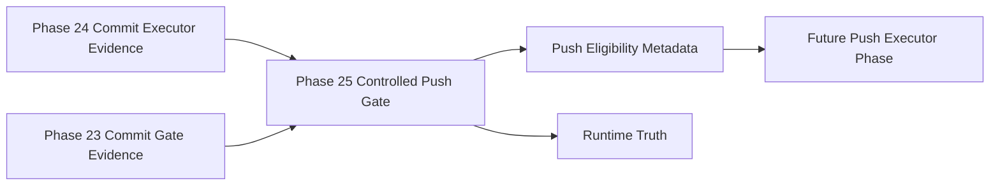

# Omni Controlled Push Gate Architecture

Phase 25 inserts a metadata-only gate between controlled commit execution and any future push execution phase.

## Responsibility

The Controlled Push Gate answers one question: is this committed non-main branch eligible for a future governed push?

It does not push, contact remotes, execute commands, mutate Git, stage files, commit, open PRs, merge, rebase, create branches, checkout branches, call providers, call MCP, call agents, use network access, edit files, apply patches, or write Vault files.

## Inputs

The gate consumes supplied metadata:

- Phase 24 commit executor result
- optional Phase 23 commit gate result
- optional Phase 22 validation result
- branch metadata
- remote metadata
- commit SHA metadata
- committed file metadata

It does not inspect Git or contact a remote.

## Decision Model

Modes:

- `disabled`
- `dry_run`
- `evaluate_push`
- `blocked`

`disabled` is the default. `dry_run` validates evidence but does not mark push eligibility true. `evaluate_push` may set `push_eligible` only when commit evidence is clean, branch metadata is non-main, remote metadata is safe, files are safe, force push is absent, main push is absent, and Runtime Truth is clean.

## Output

The result includes:

- `push_eligible`
- `push_ready_metadata_only`
- `push_plan`
- `required_pre_push_checks`
- branch and remote safety flags
- child Runtime Truth references
- blocked and escalation reasons

All execution capability flags remain false.

## Future Integration

A future push executor may consume `push_eligible`, `push_plan`, and Runtime Truth from this gate. That future phase must implement its own fixed Git push allowlist, human approval boundaries, Runtime Truth, and CI/PR controls before any real remote mutation is permitted.

Phase 26 is that executor boundary. It revalidates Phase 25 evidence and may perform only a fixed `origin` branch push on a non-main branch. PR creation, merge, rebase, branch creation, checkout, and force push stay outside this gate and outside the Phase 26 executor.
