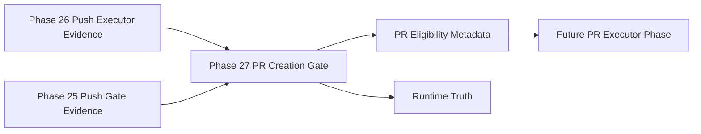

# Omni PR Creation Gate

Phase 27 inserts a metadata-only gate between controlled branch push and a future PR executor.

## Responsibility

The gate answers one question: is this pushed non-main branch eligible for future governed PR creation?

It does not create PRs, call GitHub APIs, execute `gh`, execute commands, mutate Git, push, merge, rebase, contact GitHub, call providers, use MCP, call agents, edit files, apply patches, or write Vault files.

## Inputs

The gate consumes supplied metadata:

- Phase 26 push executor result
- optional Phase 25 push gate result
- optional Phase 24 commit executor result
- optional Phase 23 commit gate result
- repository metadata
- source/head/base branch metadata
- PR title/body metadata
- labels, reviewers, and assignees metadata

It does not inspect Git and does not contact GitHub.

## Output

The result includes:

- `pr_eligible`
- `pr_ready_metadata_only`
- `pr_plan`
- proposed PR title and body
- labels, reviewers, and assignees metadata
- required pre-PR checks
- child Runtime Truth references
- blocked and escalation reasons

All PR creation, merge, auto-merge, push, force push, and command capability flags remain false.
