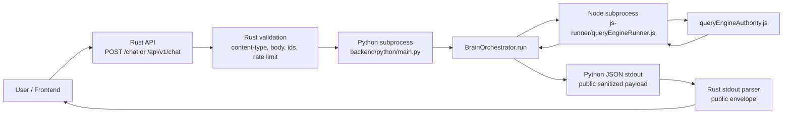
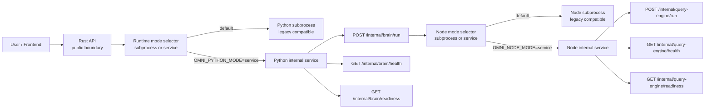

# Persistent Runtime Services Plan

Status: planning only. No runtime behavior changes are implemented by this document.

## Objective

Move Omni from subprocess-per-request execution toward persistent internal Python and Node services, while preserving the current subprocess mode as the default rollback path until service mode is proven stable.

## Evidence From Current Runtime

Inspected paths:

- `backend/rust/src/main.rs`
- `backend/python/main.py`
- `backend/python/brain/runtime/orchestrator.py`
- `js-runner/queryEngineRunner.js`
- `src/queryEngineRunnerAdapter.js`
- `core/brain/queryEngineAuthority.js`
- `Dockerfile.demo`
- `docker-compose.demo.yml`
- `docs/architecture/bridge-pipeline.md`
- `docs/architecture/bridge-response-contract.md`
- `docs/architecture/runtime-modes.md`
- `docs/audit/PHASE_2_RUNTIME_TRUTH_CONTRACT.md`
- `docs/audit/PHASE_3_TOOL_GOVERNANCE_ENFORCEMENT.md`
- `docs/audit/PHASE_5_INPUT_VALIDATION_RATE_LIMITING.md`
- `docs/audit/PHASE_6_CONTAINER_PUBLIC_DEMO.md`
- `docs/training/TRAINING_READINESS.md`

## Current Runtime Flow



### Rust Boundary

`backend/rust/src/main.rs` is the public API boundary. It owns:

- `POST /chat`
- `POST /api/v1/chat`
- `/health`
- public input validation and body limits
- in-memory rate limiting
- Python subprocess invocation through `call_python(...)`
- Python stdout JSON parsing
- bridge fallback classes for empty stdout, invalid JSON, non-zero exit, timeout, and subprocess failure

Phase 5 means invalid requests must remain rejected before Python/Node execution.

### Python Boundary

`backend/python/main.py` is the Rust-to-Python bridge entrypoint. It owns:

- stdin bridge payload resolution
- environment bridge setup
- orchestrator construction
- public payload shaping
- JSON-only stdout emission
- structured Python bridge failure responses

It must remain a public-safe backend boundary even after a service mode is introduced.

### Python Brain Runtime

`backend/python/brain/runtime/orchestrator.py` is the central runtime path. It owns:

- routing and strategy dispatch
- runtime truth inspection
- fallback classification
- Node subprocess invocation
- action execution
- governance, provenance, memory, learning, and output composition integration

The current Node call path still uses subprocess transport and must remain available.

### Node QueryEngine Boundary

`js-runner/queryEngineRunner.js`, `src/queryEngineRunnerAdapter.js`, and `core/brain/queryEngineAuthority.js` own:

- strict stdin/stdout JSON runner behavior
- matcher/local/direct/bridge/action semantic lanes
- tool governance before execution
- public-safe Node fallback payloads
- provider/tool/provenance metadata

### Current Subprocess Boundaries

- Rust -> Python: subprocess stdin/stdout with timeout and structured fallback.
- Python -> Node: subprocess stdin/stdout with timeout and structured fallback.
- Node -> QueryEngine: in-process JS module invocation after module resolution.

### Public Payload And Sanitizer Boundaries

Current public-safe boundaries must remain:

- Python public runtime payload sanitization before stdout.
- Rust parser preserves public fields and converts malformed stdout into degraded public errors.
- Frontend debug sanitizer protects against legacy/raw payloads.
- Learning redaction protects persisted records.

### Governance, Runtime Truth, And Taxonomy Boundaries

Persistent services must preserve:

- Phase 2 runtime truth: no fallback/matcher/provider failure may be `FULL_COGNITIVE_RUNTIME`.
- Phase 3 governance: sensitive tools are evaluated before execution.
- Phase 8 taxonomy: public errors use safe `error_public_code`, `error_public_message`, `severity`, `retryable`, and `internal_error_redacted`.
- Phase 9/13 learning/training safety: unsafe records are not positive training data.

## Proposed Target Architecture



### Rust API Remains Public Boundary

Rust remains the only public HTTP boundary for chat. Python and Node services are internal-only and must not be exposed to public traffic.

### Python Internal Service

Planned endpoints:

- `POST /internal/brain/run`
- `GET /internal/brain/health`
- `GET /internal/brain/readiness`

`POST /internal/brain/run` should accept the same normalized bridge payload currently written to Python stdin by Rust. Its response should match the current Python stdout JSON contract.

### Node Internal Service

Planned endpoints:

- `POST /internal/query-engine/run`
- `GET /internal/query-engine/health`
- `GET /internal/query-engine/readiness`

`POST /internal/query-engine/run` should accept the same normalized payload currently sent to `js-runner/queryEngineRunner.js`. Its response should match the current Node runner JSON contract accepted by Python.

## Feature Flags

Canonical:

```txt
OMNI_PYTHON_MODE=subprocess|service
OMNI_NODE_MODE=subprocess|service
```

Legacy aliases:

```txt
OMINI_PYTHON_MODE=subprocess|service
OMINI_NODE_MODE=subprocess|service
```

Precedence:

- `OMNI_*` is preferred.
- `OMINI_*` remains a fallback alias.
- Default remains `subprocess`.

## Backward Compatibility

- Subprocess mode remains default until service mode is validated in CI, local dev, and public demo.
- Existing Python entrypoint and Node runner remain supported.
- Service mode is gated by env flags.
- Optional fallback from service to subprocess must be controlled by a separate explicit flag in implementation, not implicit silent downgrade.
- Public `/chat` and `/api/v1/chat` response contracts must not break.
- Runtime truth must report service degraded states truthfully.

## Circuit Breaker And Fallback Plan

Each internal service client should include:

- connect timeout
- request timeout
- bounded retry budget
- unhealthy service tracking
- half-open recovery after cooldown
- structured failure class
- no raw stdout/stderr/path/env in public payloads

Failure mapping:

| Failure | Public mode | Taxonomy |
| --- | --- | --- |
| Python service timeout | `SAFE_FALLBACK` or `PARTIAL_COGNITIVE` | `TIMEOUT` or `PYTHON_ORCHESTRATOR_FAILED` |
| Python service unavailable | `SAFE_FALLBACK` | `PYTHON_ORCHESTRATOR_FAILED` |
| Python service invalid JSON | `SAFE_FALLBACK` | `PYTHON_ORCHESTRATOR_FAILED` |
| Node service timeout | `NODE_FALLBACK` | `TIMEOUT` or `NODE_RUNNER_FAILED` |
| Node service unavailable | `NODE_FALLBACK` | `NODE_RUNNER_FAILED` |
| Node service empty response | `NODE_FALLBACK` | `NODE_EMPTY_RESPONSE` |
| Governance block | `TOOL_BLOCKED` | `TOOL_BLOCKED_BY_GOVERNANCE` |

Circuit breaker rule:

- degraded/fallback service paths must never report `FULL_COGNITIVE_RUNTIME`.
- fallback to subprocess, if enabled, must set explicit provenance such as `service_fallback_to_subprocess=true`.

## Observability Requirements

All modes must propagate:

- `request_id`
- client/session identifiers after validation
- Rust latency
- Python service/subprocess latency
- Node service/subprocess latency
- provider latency when available
- runtime_mode
- runtime_reason
- semantic/execution lane
- provider status
- tool status
- governance status
- error_public_code
- service health/readiness status

No observability payload may include:

- raw secrets
- raw env
- raw provider payload
- raw tool payload
- command args
- stdout/stderr
- stack traces
- local absolute paths

## Security Requirements

- Python and Node services must bind only to internal network interfaces in production.
- Rust remains the only public ingress.
- Public demo mode keeps shell disabled and internal debug disabled.
- Tool governance remains before execution.
- Shell policy remains deny-by-default.
- Sanitization and redaction remain at all public/logging/training boundaries.
- Internal service endpoints should require either private network isolation or an internal shared token mounted as runtime-only secret if deployed across containers.
- Health/readiness endpoints must expose status only, not raw config.

## Deployment Plan

### Local Development

Default:

```txt
OMNI_PYTHON_MODE=subprocess
OMNI_NODE_MODE=subprocess
```

Service trial:

```txt
OMNI_PYTHON_MODE=service
OMNI_NODE_MODE=service
```

### Public Demo

Public demo should remain subprocess-first until service readiness is proven:

```txt
OMNI_PUBLIC_DEMO_MODE=true
OMNI_ALLOW_SHELL_TOOLS=false
OMNI_DEBUG_INTERNAL_ERRORS=false
OMNI_PYTHON_MODE=subprocess
OMNI_NODE_MODE=subprocess
```

### Docker / Compose

Possible implementation options:

- single container with Rust public API plus internal Python/Node processes managed by a lightweight process supervisor
- multi-service compose with private network: `omni-api`, `omni-brain`, `omni-query-engine`
- keep existing `Dockerfile.demo` subprocess profile as rollback baseline

Healthcheck/readiness requirements:

- Rust `/health` stays public-safe.
- Python `/internal/brain/health` returns liveness.
- Python `/internal/brain/readiness` confirms orchestrator dependencies.
- Node `/internal/query-engine/health` returns liveness.
- Node `/internal/query-engine/readiness` confirms module resolution and provider/tool registry readiness.

Known Phase 6 limitation:

- local Docker build validation was blocked by unavailable Docker daemon; service container build must be validated in a daemon-enabled CI/host before adoption.

## Migration Subphases

### 11A Python Service

Estimate: ~2 weeks.

Scope:

- add internal Python HTTP service wrapper
- expose `/internal/brain/run`, `/health`, `/readiness`
- preserve `backend/python/main.py` CLI/stdin path
- share existing orchestrator construction and public payload sanitizer
- add contract tests comparing stdin output vs service output

### 11B Node Service

Estimate: ~2 weeks.

Scope:

- add internal Node service around QueryEngine runner contract
- expose `/internal/query-engine/run`, `/health`, `/readiness`
- preserve `js-runner/queryEngineRunner.js`
- keep strict JSON response shape
- add contract tests comparing runner output vs service output

### 11C Rust Internal Client

Estimate: ~1 week.

Scope:

- add Rust internal client for Python service mode
- feature flag mode selection
- keep current `call_python(...)` subprocess path
- preserve `/chat` validation before runtime invocation
- add timeout and public error mapping tests

### 11D Circuit Breaker / Fallback

Estimate: ~1 week.

Scope:

- add health-aware circuit breaker
- bounded retry policy
- optional explicit fallback to subprocess
- runtime truth/provenance for service degraded paths
- dashboard-visible service health

Total estimate: ~6 weeks.

## Rollback Strategy

- Set `OMNI_PYTHON_MODE=subprocess`.
- Set `OMNI_NODE_MODE=subprocess`.
- Revert service-specific branches if needed.
- Keep old Python stdin runner and Node CLI runner.
- No data migration is required initially.
- Public response contract remains unchanged, so frontend rollback is not required.

## Risks

- service lifecycle complexity
- concurrency/state bugs in long-lived Python orchestrator state
- Node module cache and state leakage between requests
- timeout semantics diverging from subprocess behavior
- duplicate observability paths
- Docker/CI gaps
- local dev complexity
- hidden fallback to subprocess masking service defects if not explicitly classified

## Gate Before Implementation

Do not begin implementation until:

- subprocess contract tests are green
- service request/response schemas are frozen
- circuit breaker taxonomy mapping is agreed
- health/readiness public-safe payloads are specified
- Docker/CI can validate service profile
